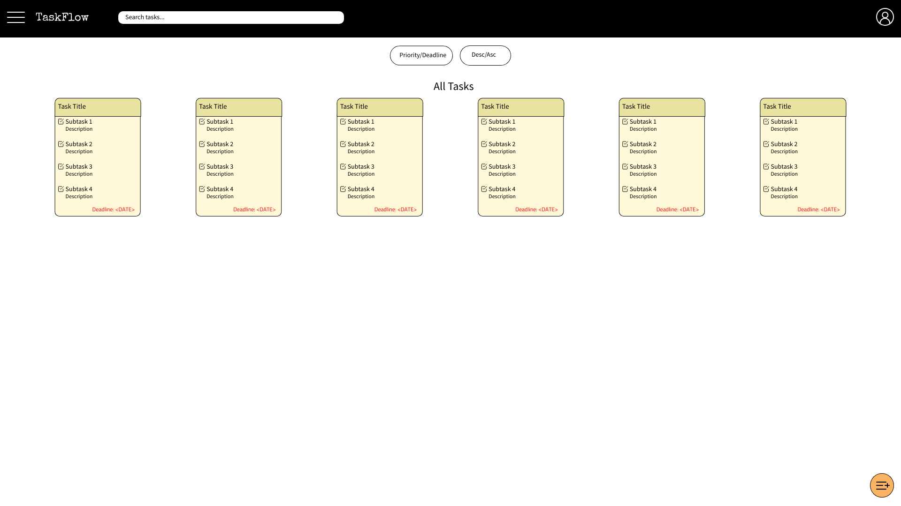
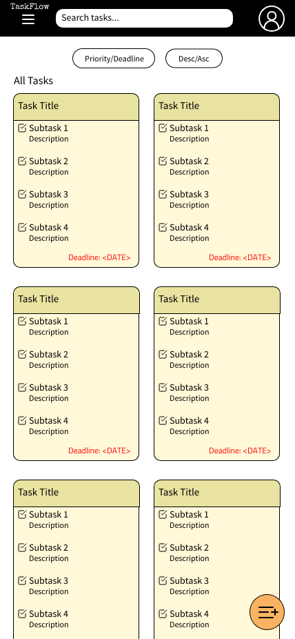

# TaskFlow

> The frontend for a Task Managament Web App built using React.

## Table of contents
* [General Information](#general-information)

* [Technologies Used](#technologies-used)

* [Setup](#setup)

* [Project Status](#project-status)

* [Room for Improvement](#room-for-improvement)

* [Project Takeaways](#project-takeaways)


## Basic Wireframes:



## General Information:
- Build a functioning task management web app using React
- Allow users to register and log in via the client side using TaskFlow account.
- Allow creation of tasks and subtasks
- Allow viewing of tasks and subtasks
- Allow viewing of a single task
- Allow sorting of tasks by deadline date or created date
- Allow adding, editing and deletion of tasks and subtasks
- Allow removal of tasks and subtasks
- Allow logout of users
- Allow editing of user info
- Use Git version control
- Use command line
- Develop locally on your computer


## Technologies Used:
- `@reduxjs/toolkit`: ^2.2.3,
- `axios`: ^1.6.8,
- `react-redux`: ^9.1.1,
- `react-router-dom`: ^6.22.3,
- `@emotion/react`: "^11.11.4",
- `@emotion/styled`: "^11.11.5",
- `@mui/icons-material`: "^5.15.15",
- `@mui/lab`: "^5.0.0-alpha.170",
- `@mui/material`: "^5.15.15",
- `@mui/x-date-pickers`: "^7.2.0",
- `date-fns`: "^3.6.0",
- `uuid`: "^9.0.1",

## Setup
To set up locally, begin by installing node_modules:

```
npm install
```

This command will also execute the `install` script from `package.json`.
  

Then run the app which is located in `client/` directory:

```
npm start
```

## Project Status
In Progress: 
- Engaged in persisting user login.
- Engaged in adding more cypress e2e testing. 

## Room for Improvement
Room for improvement:
- Better use of redux.
- Handling of errors.

To-Do:
- Engaged in persisting user login.

## Project Takeaways
- Better ways of handling errors.
- Learn typescript for react.
- Better implementation of CSS.