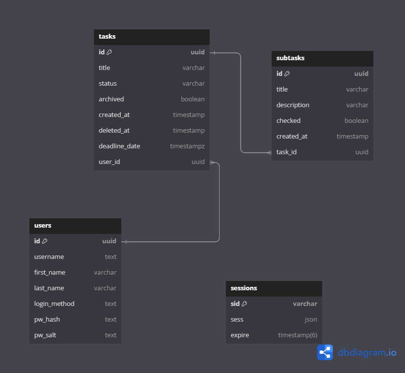

# TaskFlow API

> The backend API for a Task Management Web App built using Node.js, Express and Postgres. (PERN)

## Table of contents
* [General Information](#general-information)

* [Features](#features)

* [Technologies Used](#technologies-used)

* [Setup](#setup)

* [Usage](#usage)

* [Project Status](#project-status)

* [Room for Improvement](#room-for-improvement)

* [Project Takeaways](#project-takeaways)


## ERD Diagram:


## General Information:
- Build a functioning task management REST API using Express, Node.js, and Postgres
- Allow users to register and log in via the API
- Allow CRUD operations on tasks
- Allow CRUD operations on subtasks
- Allow CRUD operations on users
- Allow a user to create a task, add subtasks to it, add a deadline date to the task, and etc.
- Use Git version control
- Use command line
- Develop locally on your computer

## Features
Coming soon…

## Technologies Used:
### Server
- `node.js` 
- `npm`
- `express`
- `express-session`
- `jsonwebtoken`
- `nodemon`
- `cors`
- `passport-jwt`

### Database
- `psql` (PostgreSQL CLI)
- `connect-pg-simple`
- `pg` (node-postgres)

## Setup
To set up locally, begin by installing node_modules:

```
npm install
```

This command will also execute the `install` script from `package.json`.

Open a PostgreSQL database of your choice. Schema with tables is located in `config/db/init.sql`. E.g., generate tables by running:

```
cd db
cat init.sql | psql -h [PGHOST] -U [PGUSER] -d [PGDATABASE] -w [PGPASSWORD]
```

Replace 'PGHOST', 'PGUSER', 'PGDATABASE', and 'PGPASSWORD' with your PostgreSQL host, user, database, and password values, respectively.

Add the following fields with respective values to the `.env` file:
  
```
# Postgres Database
DB_USER=
DB_PASSWORD=
DB_HOST=
DB_PORT=
DB_DATABASE=

# Express server
SESSION_SECRET=

# Node env
NODE_ENV=
DATABASE_URL=
EXTERNAL_DATABASE_URL=

# Client URL
CLIENT_URL=

# Port
PORT=
```

Then run the app which is located in `app/` directory:

```
npm start
```

## Usage
This project serves as a backend for a task management web app.
It manages multiple endpoints crucial for task management, such as:
- creating user accounts.
- creating new tasks and subtasks by task id.
- displaying tasks and subtasks and allowing query by parameter.

## Project Status
In Progress: 
- Nothing at the moment

## Room for Improvement
Room for improvement:
- Better handling of 4xx errors

To-Do:
- Add google Oauth2 passport strategy.

## Project Takeaways
- More code coverage on tests.
- Better ways of error handling.